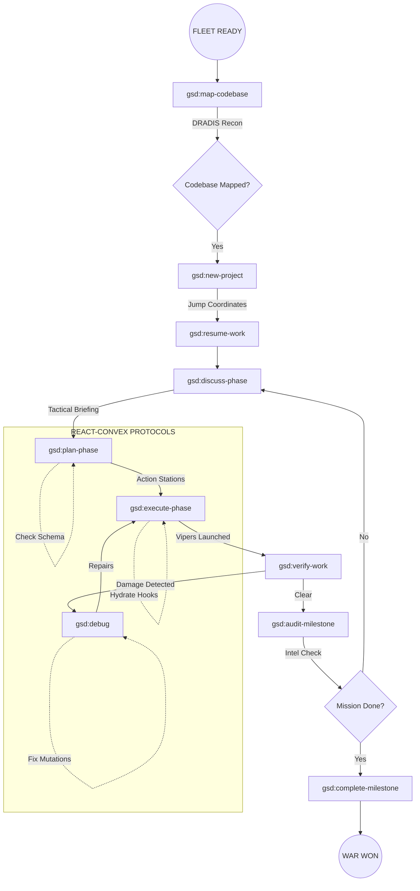

# COLONIAL FLEET OPERATIONAL PROTOCOL: GSD (GET SHIT DONE)

> "Fleeing the Cylon tyranny, the last Battlestar, Galactica, leads a rag-tag fugitive fleet on a lonely quest... to Get Shit Done."

This manual outlines the standard operating procedures for the **GSD Build System**, specifically tailored for the **React-Convex** fleet.

## I. TACTICAL FLOW DIAGRAM

---

## II. OPERATIONAL DIRECTIVES

### 1. DRADIS RECONNAISSANCE (Mapping)
Before jumping into a brownfield codebase, you must map the sector.
- **Command**: `/gsd:map-codebase`
- **Objective**: Identify React component hierarchies and Convex schema dependencies.
- **Tactical Tip**: Run this after adding new Convex functions to ensure the agent understands the updated data model.

### 2. THE JUMP (Initialization)
- **Command**: `/gsd:new-project`
- **Objective**: Establish the roadmap.
- **React Focus**: Define which components are "Vipers" (Core UI) and which are "Raptors" (Data Fetches).

### 3. STRATEGIC BRIEFING (Planning)
- **Command**: `/gsd:discuss-phase` & `/gsd:plan-phase`
- **Objective**: Locked-in technical decisions.
- **Convex Protocol**: Lock in your `mutation` names and `v.string()` types before code generation starts.
- **React Protocol**: Decide on "Composition over Inheritance" during this phase.

### 4. COMBAT ENGAGEMENT (Execution)
- **Command**: `/gsd:execute-phase`
- **Objective**: Launch the code waves.
- **Command**: `/gsd:quick`
- **Objective**: Fast strike for single-file UI tweaks or prop updates.

### 5. DAMAGE CONTROL (Debugging)
- **Command**: `/gsd:debug [description]`
- **Objective**: Neutralize Cylon interference (Bugs).
- **Convex Focus**: Use for "Uncaught Error: schema mismatch" or mutation errors.
- **React Focus**: Use for hydration errors and "useEffect" infinite loops.

### 6. BATTLE ASSESSMENT (Verification)
- **Command**: `/gsd:verify-work`
- **Objective**: Confirm mission success.
- **Command**: `/gsd:audit-milestone`
- **Objective**: High-level review of the entire mission's progress.

---

## THE COMMANDMENTS

1.  **INITIATE**: Identify the target and lock on. No project starts without a clear Dradis signature.
2.  **DISCUSS**: Brief the pilots. Every detail matters before the jump.
3.  **PLAN**: Plot the course. Aim small, miss small.
4.  **EXECUTE**: Weapons hot. Burn the code and clear the deck.
5.  **VERIFY**: Check the logs. If the target isn't destroyed, pivot and re-engage.

**SO SAY WE ALL.**
