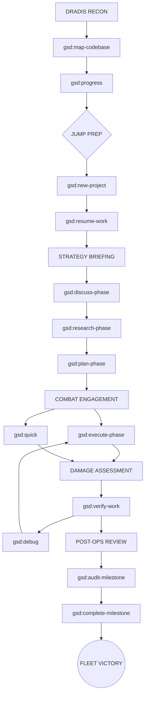

# COLONIAL FLEET MASTER MANUAL: GSD (GET SHIT DONE)

> "Fleeing the Cylon tyranny, the last Battlestar, Galactica, leads a rag-tag fugitive fleet on a lonely quest... to Get Shit Done."

This is the definitive guide for the **GSD Build System**, hardened for the **React-Convex** fleet.

---

## I. TACTICAL STATUS FLOW (TOP-TO-BOTTOM)

---

## II. COMMAND DECK ENCYCLOPEDIA

### 1. DRADIS & INTEL (Status & Recon)
- **`/gsd:map-codebase` (Scout Raptor)**: Essential for React/Convex. Maps the directory structure, hooks, and schema files so the agent knows the terrain.
- **`/gsd:progress` (Fleet Status Board)**: Shows where every Viper (Phase) is in the mission.
- **`/gsd:list-phase-assumptions [N]` (Intel Briefing)**: Lists what the pilots think they know about a phase before launching.
- **`/gsd:check-todos` (Crew Duty Roster)**: Scans for [ ] items across the fleet.
- **`/gsd:help` (Operational Handbooks)**: Access the manual from the cockpit.

### 2. FLEET LOGISTICS (Settings & Maintenance)
- **`/gsd:settings` (Ship Configuration)**: Core GSD parameters.
- **`/gsd:set-profile [profile]` (Pilot Loadout)**: Switches agent specialized roles (e.g., Performance Tuning vs. Feature Build).
- **`/gsd:update` (Ship Yard Refit)**: Pulls the latest GSD tech from the fleet archives.
- **`/gsd:reapply-patches` (Battle Repairs)**: Restores local fleet modifications after an update.
- **`/gsd:join-discord` (Colonial Comms Link)**: Connect with other commanders in the fleet.

### 3. JUMP PREP (Initialization & Management)
- **`/gsd:new-project` (Setting Coordinates)**: The first jump. Define the mission parameters.
- **`/gsd:new-milestone [name]` (New Sector Exploration)**: Define a major fleet objective.
- **`/gsd:add-phase` / `/gsd:insert-phase` (Mission Path Adjustment)**: Add or rearrange tactical objectives.
- **`/gsd:remove-phase` (Target Eliminated)**: Strip out unnecessary objectives.
- **`/gsd:resume-work` (Coming out of FTL)**: Get back to work after a break.
- **`/gsd:pause-work` (Going into Cloak)**: Save the current state and standby.

### 4. TACTICAL PLANNING
- **`/gsd:discuss-phase [N]` (The CIC Briefing)**: Hammer out how the React UI or Convex mutation should function.
- **`/gsd:research-phase [N]` (Advanced Recon)**: Spawns agents to investigate specific tech stacks or libraries (e.g., "Best way to implement Convex file storage").
- **`/gsd:plan-phase [N]` (Action Stations)**: Turns discussion into atomic task plans.
- **`/gsd:plan-milestone-gaps` (Tactical Gap Analysis)**: Identifies what's missing in the current sector's objective.

### 5. COMBAT ENGAGEMENT
- **`/gsd:execute-phase <N>` (Launch Vipers)**: The heavy lifting. Parallel/Sequential execution of all tasks in a phase.
- **`/gsd:quick` (Point Defense Strike)**: Use for fast, single-file fixes like updating a prop or a Tailwind class.

### 6. DAMAGE CONTROL (Debugging)
- **`/gsd:debug [desc]` (Repair Crew)**: Targetted bug squashing. 
  - *React Tip*: Use for hydration errors or "Key" prop warnings.
  - *Convex Tip*: Use for schema validation failures.

### 7. POST-OPS (Post-Mission Review)
- **`/gsd:verify-work [N]` (Combat Assessment)**: Confirm the vipers did their job.
- **`/gsd:audit-milestone` (Intelligence Review)**: Final check of all requirements against deliverables.
- **`/gsd:complete-milestone` (Mission Accomplished)**: Secure the sector and move to the next.

---

## III. REACT-CONVEX BATTLE DIRECTIVES

1.  **SCHEMA FIRST**: Never `/gsd:plan-phase` without first `/gsd:discussing` the Convex schema changes.
2.  **HYDRATION DEFENSE**: If a React hydration error occurs, immediately signal `/gsd:debug`.
3.  **ATOMIC COMMITS**: GSD commits per task. This is your "Black Box" flight data recorder.

**SO SAY WE ALL.**
