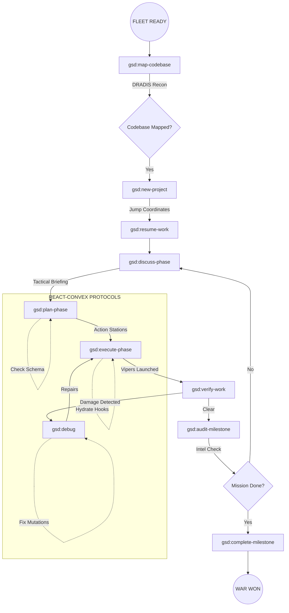

# GSD TACTICAL FLOW: COLONIAL FLEET OPERATIONAL PROTOCOL

> "To survive, we must build. To build, we must Get Shit Done."

```mermaid
graph TD
    %% PHASE 0: RECON
    START((FLEET READY)) --> MAP[gsd:map-codebase]
    MAP -- DRADIS Recon --> RECON{Codebase Mapped?}
    
    %% PHASE 1: JUMP
    RECON -- Yes --> INIT[gsd:new-project]
    INIT -- Jump Coordinates --> SYNC[gsd:resume-work]
    
    %% PHASE 2: STRATEGY
    SYNC --> DISCUSS[gsd:discuss-phase]
    DISCUSS -- Tactical Briefing --> PLAN[gsd:plan-phase]
    
    %% PHASE 3: ENGAGEMENT
    PLAN -- Action Stations --> EXEC[gsd:execute-phase]
    EXEC -- Vipers Launched --> VERIFY[gsd:verify-work]
    
    %% PHASE 4: DAMAGE CONTROL & AUDIT
    VERIFY -- Damage Detected --> DEBUG[gsd:debug]
    DEBUG -- Repairs --> EXEC
    
    VERIFY -- Clear --> AUDIT[gsd:audit-milestone]
    AUDIT -- Intel Check --> DONE{Mission Done?}
    
    %% PHASE 5: VICTORY
    DONE -- No --> DISCUSS
    DONE -- Yes --> COMP[gsd:complete-milestone]
    COMP --> WIN((WAR WON))

    %% REACT/CONVEX SPECIAL DIRECTIVES
    subgraph "REACT-CONVEX PROTOCOLS"
    PLAN -.-> |"Check Schema"| PLAN
    EXEC -.-> |"Hydrate Hooks"| EXEC
    DEBUG -.-> |"Fix Mutations"| DEBUG
    end
```

**SO SAY WE ALL.**
